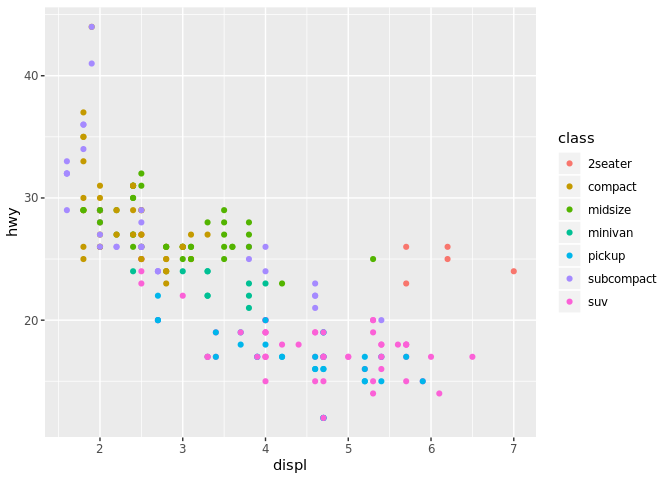

Chapter 3: Data Visualization
================
Brianna Cabrera
9/24/19

3.1.1
-----

3.2.2
-----

``` r
ggplot(data = mpg) + 
  geom_point(mapping = aes(x = displ, y = hwy))
```


3.3.4 Exercises
---------------

``` r
ggplot(data = mpg)
```

 The code ran, but there is no graph.

``` r
ggplot(data = mpg) + 
  geom_point(mapping = aes(x = hwy, y = cyl))
```


``` r
ggplot(data = mpg) + 
  geom_point(mapping = aes(x = class, y = drv))
```

 This graph doesn't give us any useful information. DRV is not a useful variable to measure the different classes of cars by.

3.3.1 Exercises
---------------

1.  The "color"blue"" part of the code needs to be in its own parentheses and not next to the x and y variables.
2.  

``` r
?mpg
```

The categorical variables include the model, trans, drv, fl, and class. The continuous variables include displ, year, cly, cty, and hwy. If you run "mpg" in a code chunk you are able to view all this information.

1.  

``` r
ggplot(data = mpg,mapping = aes(x = displ, y = hwy)) +
  geom_point(mapping = aes(color=class))
```


