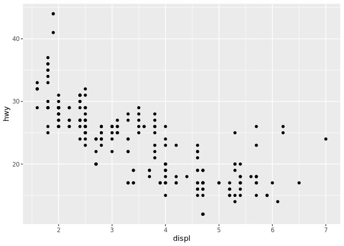

Chapter 3: Data Visualization
================
Brianna Cabrera
9/24/19

3.1.1
-----

``` r
car<-mpg
```

3.2.2
-----

``` r
ggplot(data = mpg) + 
  geom_point(mapping = aes(x = displ, y = hwy))
```



3.3.4 Exercises
---------------

``` r
ggplot(data = car)
```

 The code ran, but there is no graph.

``` r
ggplot(data = mpg) + 
  geom_point(mapping = aes(x = hwy, y = cyl))
```


``` r
ggplot(data = mpg) + 
  geom_point(mapping = aes(x = class, y = drv))
```

 This graph doesn't give us any useful information. DRV is not a useful variable to measure the different classes of cars by.

3.3.1 Exercises
---------------

1.  The "color"blue"" part of the code needs to be in its own parentheses and not next to the x and y variables.
2.  

``` r
?mpg
```

The categorical variables include the model, trans, drv, fl, and class. The continuous variables include displ, year, cly, cty, and hwy. If you run "mpg" in a code chunk you are able to view all this information.

1.  

``` r
ggplot(data = mpg,mapping = aes(x = displ, y = hwy)) +
  geom_point(mapping = aes(color=class))
```


``` r
ggplot(data = mpg,mapping = aes(x = displ, y = hwy)) +
  geom_point(mapping = aes(size=class))
```

    Warning: Using size for a discrete variable is not advised.


``` r
ggplot(data = mpg,mapping = aes(x = displ, y = hwy)) +
  geom_point(mapping = aes(shape=class))
```

    Warning: The shape palette can deal with a maximum of 6 discrete values
    because more than 6 becomes difficult to discriminate; you have 7.
    Consider specifying shapes manually if you must have them.

    Warning: Removed 62 rows containing missing values (geom_point).

 4. When you map multiple aesthetics to the same variable, the graph can become ugly and potentially bad as it changes the way the data looks.

1.  

``` r
ggplot(data = mpg,mapping = aes(x = displ, y = hwy)) +
  geom_point(mapping = aes(stroke=cty, shape="."))
```

 The stroke code makes each of the points on the graph a certain shape. 6.

``` r
ggplot(data = mpg,mapping = aes(x = displ, y = hwy)) +
  geom_point(mapping = aes(color=displ < 5))
```

 All the points greater than 5 are now red.

3.5.1 Exercises
---------------

1.  

``` r
ggplot(data = mpg) + 
  geom_point(mapping = aes(x = displ, y = hwy)) + 
  facet_wrap(~ year, nrow = 2)
```

 If you facet a continuous variable, a subset is made for each variable.

1.  

``` r
ggplot(data = mpg) + 
  geom_point(mapping = aes(x = drv, y = cyl)) + 
  facet_grid(drv ~ cyl)
```

 R leaves those grids blank and includes them in the subset graphs.

1.  

``` r
ggplot(data = mpg) + 
  geom_point(mapping = aes(x = displ, y = hwy)) +
  facet_grid(drv ~ .)
```


``` r
ggplot(data = mpg) + 
  geom_point(mapping = aes(x = displ, y = hwy)) +
  facet_grid(. ~ cyl)
```

 The "." changes the orientation of the graph.

1.  

``` r
ggplot(data = mpg) + 
  geom_point(mapping = aes(x = displ, y = hwy)) + 
  facet_wrap(~ class, nrow = 2)
```

 The advantages of faceting is that each variable gets separated into their own graph so finding what type of car you want to look at is easier. The disadvantages include that the graph isn't pretty and makes everything smaller. If you had a larger dataset, it would be harder to read the datapoints.

1.  

``` r
?facet_wrap
```

This code wraps 1 distribution sequence into 2 distributions. nrow is the number of rows and ncol is the number of columns. facet\_grid makes a grid and doesn't make columns or rows. 6. The code will organize based off of what variable is in the column.

3.6.1 Exercises
---------------

1.  Line chart: geom\_smooth Boxplot: geom\_boxplot Histogram: geom\_histogram Area Chart: geom\_density

2.  

``` r
ggplot(data = mpg, mapping = aes(x = displ, y = hwy, color = drv)) + 
  geom_point() + 
  geom_smooth(se = FALSE)
```

    `geom_smooth()` using method = 'loess' and formula 'y ~ x'


``` r
ggplot(data = mpg, mapping = aes(x = displ, y = hwy, color = drv)) + 
  geom_point() + 
  geom_smooth(se = FALSE, show.legend = FALSE)
```

    `geom_smooth()` using method = 'loess' and formula 'y ~ x'

 3. That code changed how the legend looks. I think it was used earlier because it makes the legend look a lot cleaner.

1.  It takes away the standard error behind the data points.

2.  Yes these graphs would look different. Any line of code that is added after the initial ggplot code is a layer added on top of the ggplot.

3.  

``` r
ggplot(data = mpg, mapping = aes(x = displ, y = hwy)) + 
  geom_point (mapping = aes(size=drv)) + 
  geom_smooth(se = FALSE)
```

    Warning: Using size for a discrete variable is not advised.

    `geom_smooth()` using method = 'loess' and formula 'y ~ x'


``` r
ggplot(data = mpg, mapping = aes(x = displ, y = hwy, color = drv)) + 
  geom_point(mapping = aes(size=drv)) + 
  geom_smooth(se = FALSE)
```

    Warning: Using size for a discrete variable is not advised.

    `geom_smooth()` using method = 'loess' and formula 'y ~ x'


``` r
ggplot(data = mpg, mapping = aes(x = displ, y = hwy, color = drv)) + 
  geom_point(mapping = aes(size=drv)) + 
  geom_smooth(se = FALSE, show.legend = FALSE)
```

    Warning: Using size for a discrete variable is not advised.

    `geom_smooth()` using method = 'loess' and formula 'y ~ x'


``` r
ggplot(data = mpg, mapping = aes(x = displ, y = hwy)) + 
  geom_point(mapping = aes(size=drv)) + 
  geom_smooth(se = FALSE, show.legend = FALSE)
```

    Warning: Using size for a discrete variable is not advised.

    `geom_smooth()` using method = 'loess' and formula 'y ~ x'


``` r
ggplot(data = mpg, mapping = aes(x = displ, y = hwy, color = drv, linetype=drv)) + 
  geom_point(mapping = aes(size=drv)) + 
  geom_smooth(se = FALSE, show.legend = FALSE)
```

    Warning: Using size for a discrete variable is not advised.

    `geom_smooth()` using method = 'loess' and formula 'y ~ x'


``` r
ggplot(data = mpg, mapping = aes(x = displ, y = hwy, color = drv, size = drv)) + 
  geom_point(show.legend = FALSE)
```

    Warning: Using size for a discrete variable is not advised.

 \#\#3.7.1 Exercises 1.The default geom that the code uses is a boxplot. You could write geom\_boxplot instead of the stat\_summary code.

1.  

``` r
?geom_col()
```

Geom\_col uses stat\_identity and leaves the data as is. Geom\_bar makes the height of the bar proportional to the number of cases in each group.

1.  

``` r
?stat_smooth
```

It computes the y, the ymin, the ymax, and the se. The x and y control it's behavior.

1.  That code limits the data.

3.8.1 Exercises
---------------

1.  

``` r
ggplot(data = mpg, mapping = aes(x = cty, y = hwy)) + 
  geom_jitter(mapping = aes(color=drv))
```

 All the different variables were the same color and were overlapping.

1.  

``` r
?geom_jitter
```

X and Y control the amount of jittering.

1.  

``` r
?geom_count()
```

geom\_jitter fixes the overlapping in data points while geom\_count counts the number of observations at each locations.

1.  

``` r
ggplot(data = mpg, mapping = aes(x=class, y=hwy)) +
  geom_boxplot()
```

 The default is vertical boxplots.

3.9.1
-----

1.  

``` r
install.packages("viridisLite")
```

    Installing package into '/home/cabr6710/R/x86_64-pc-linux-gnu-library/3.6'
    (as 'lib' is unspecified)

``` r
ggplot(data = diamonds, mapping = aes(x = cut, fill = clarity)) + 
  geom_bar(position = "identity") +
  coord_polar()
```

 2.

``` r
?labs()
```

A code for labeling.

1.  

``` r
?coord_quickmap
```

Both coord\_quickmap and coord\_map make projects a portion of the earth which is a flat plane, but coord\_quickmap does it on a smaller scale.

1.  The graph shows a positive linear relationship between the two variables. coord\_fixed keeps the ratio between the two variables 1:1. geom\_abline() adds a reference line for the data in the graph.
